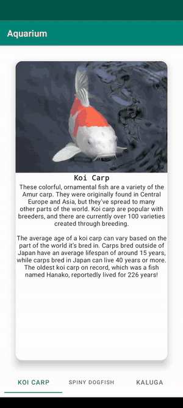

# Aquarium 🐠

A simple Android app showcasing aquarium animals using **ViewPager2** + **TabLayout** for swipeable, tab-navigable pages.

## Demo

  

## Built with

- Kotlin
- ViewPager2
- TabLayoutMediator
- Material Components
- View Binding
- Picasso (image loading)

## What I learned

- The RecyclerView Adapter pattern (ViewHolder, `onCreateViewHolder`, `onBindViewHolder`)
- How `TabLayoutMediator` wires tabs to a ViewPager2
- The order dependency: adapter must be set on ViewPager2 *before* the mediator attaches
- LinearLayout `weight` for filling remaining space

---

Part of my Hyperskill Android learning journey.
